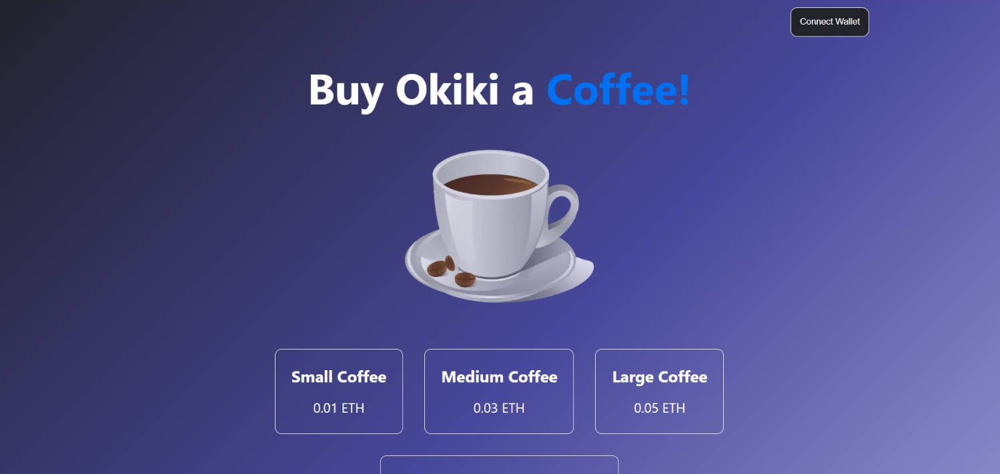
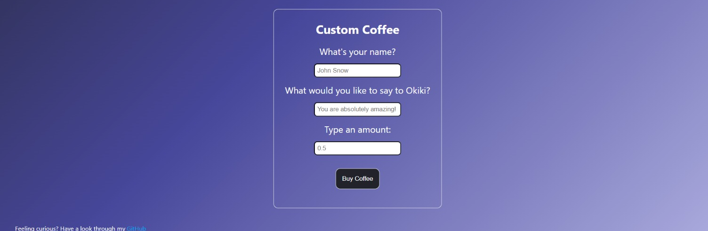

## Buy Me A Coffee V2

- A buy me a coffee dApp which supplies the received donations to Aave V3 to generate interest

- Currently only supports ETH

- The deployed address of the smart contract can be found here: [0xE9D3AB08080d797DC6856fC476e2b9BcD778Af84](https://goerli.etherscan.io/address/0xE9D3AB08080d797DC6856fC476e2b9BcD778Af84)

- The owner of the contract can withdraw these donations at any time they wish

- The frontend was built using Next.js

- Scripts and tests for the smart contract can be found in the relevant folders

<b>Website link:</b> https://buymeacoffee-v2-1.okikicodes.repl.co/

To use this, make sure your wallet is funded with Goerli ETH. If you need to add ETH to your wallet, top up at this faucet: https://goerlifaucet.com/

#### Preview of the website:

<b>Demo:</b>

https://user-images.githubusercontent.com/92333005/184411101-61f09d71-6705-4d23-9b56-8599dff58f39.mp4

 

#### Test Transactions With This Contract:

- https://goerli.etherscan.io/tx/0x499cf50e2ab827b15732ef79ec7af9e02a729fb41738c9352241a428082d9a74

- https://goerli.etherscan.io/tx/0x38985a0db1f715eb2e68c65a61c16ef80034c47342d88f9ad68928f2913994ae

 

  
<b>To have a look at the V1 repository, click here:</b> https://github.com/Okiki-Olugunna/BuyMeACoffee-V1 
